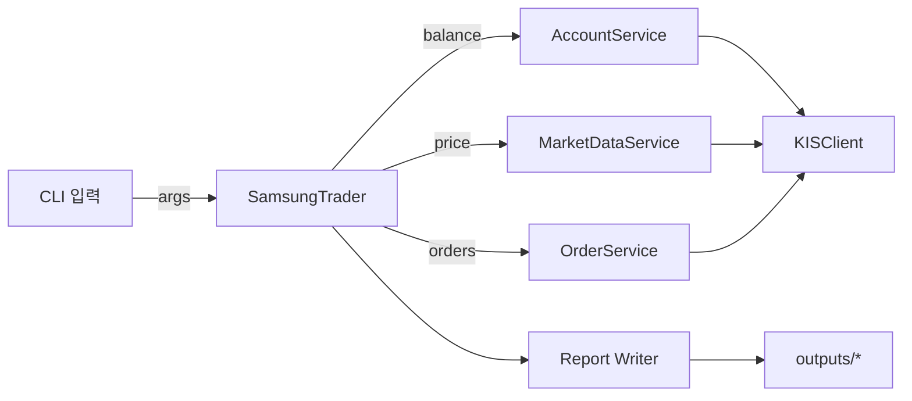
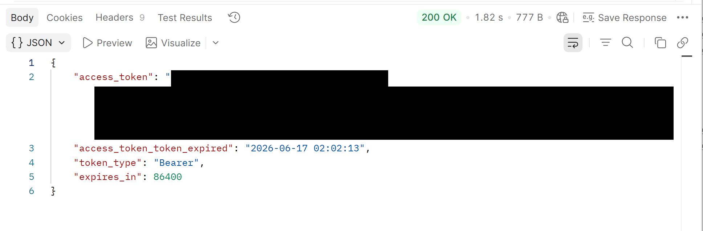
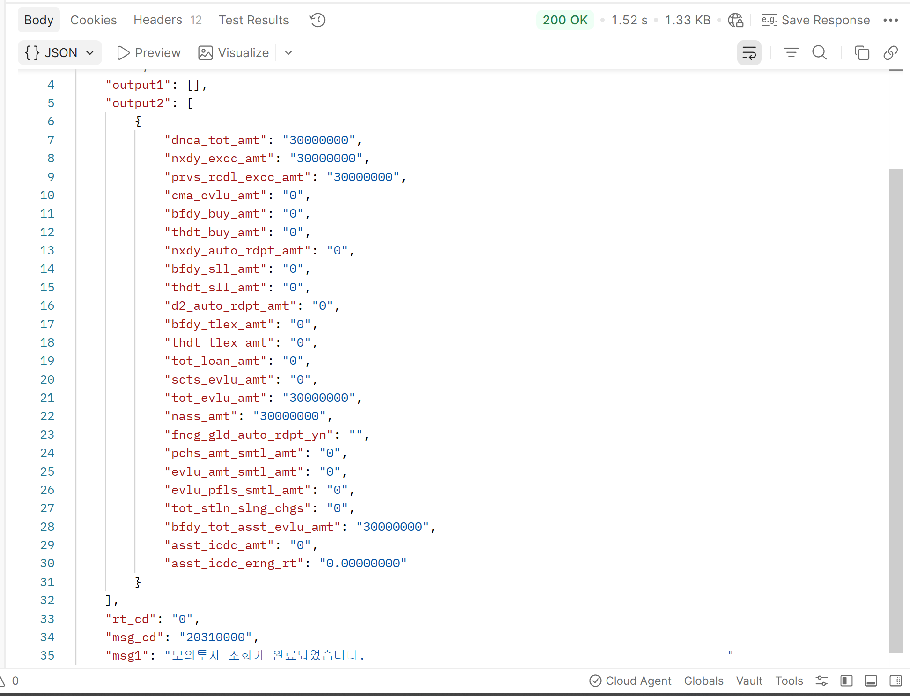
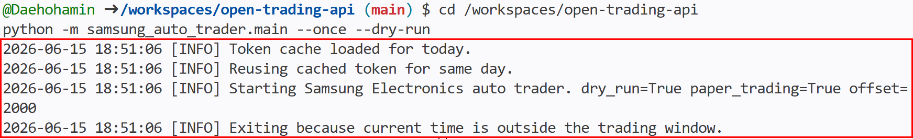

# Samsung Electronics Auto Trader

이 프로젝트는 한국투자증권(KIS) Open API REST만을 사용하여 삼성전자(005930) 모의투자 자동매매를 수행하는 Python 시스템입니다. REST 기반으로 안전한 모의투자 주문, 계좌 조회, 보고서 생성을 지원합니다.

## 주요 개선 사항
- `get_price()`는 `tr_id: FHKST01010100`을 전송합니다.
- `get_balance()`는 `tr_id: VTTC8434R`과 `CTX_AREA_FK100` / `CTX_AREA_NK100`을 포함합니다.
- 모의현금 주문 TR ID는 공식 예제 기준 `VTTC0012U`(buy), `VTTC0011U`(sell)입니다.
- 계좌 조회는 `output1`에서 보유 종목을, `output2`에서 요약/현금을 파싱합니다.
- 주문 수량은 최소 1주, 최대 `MAX_ORDER_QUANTITY`로 제한됩니다.
- 삼성전자 보유 수량이 부족하면 매도 주문을 제출하지 않습니다.
- 거래 시간은 `Asia/Seoul` 기준 `09:10–15:30`으로 계산합니다.
- 실거래는 항상 비활성화되며 `--no-paper-trading` 사용은 차단됩니다.
- `--no-dry-run`은 `--confirm-paper-order`와 함께 사용해야 합니다.
- `--inspect`, `--show-orders`, `--report`, `--quantity`, `--buy-only`, `--sell-only` 옵션을 지원합니다.

## 실행 준비
### 필수 환경변수
- `GH_ACCOUNT`
- `GH_APPKEY`
- `GH_APPSECRET`

### 선택 환경변수
- `GH_PRODUCT_CODE` (기본값 `01`)

## 안전한 실행 명령
- 도움말 확인:
  - `python -m samsung_auto_trader.main --help`
- dry-run 단일 사이클:
  - `python -m samsung_auto_trader.main --once --dry-run --quantity 1`
- inspect 읽기 전용 모드:
  - `python -m samsung_auto_trader.main --inspect --show-orders --report`
- 모의투자 주문 제출(명시 확인 필요):
  - `python -m samsung_auto_trader.main --once --no-dry-run --confirm-paper-order --quantity 1`

## 옵션 설명
- `--once`: 한 사이클만 실행하고 종료
- `--dry-run`: 주문을 전송하지 않음
- `--no-dry-run`: 실제 주문 전송 허용 전 단계
- `--confirm-paper-order`: `--no-dry-run`과 함께 사용해야 함
- `--paper-trading`: 모의투자 TR ID 사용
- `--no-paper-trading`: 금지됨(실거래 비활성화 유지)
- `--offset`: 매수/매도 가격 오프셋
- `--quantity`: 주문 수량 (기본값 1)
- `--buy-only`: 매수만 실행
- `--sell-only`: 매도만 실행
- `--show-orders`: 최근 주문 내역 표시
- `--report`: 민감 정보를 제거한 보고서 생성
- `--inspect`: 읽기 전용 상태 점검

## 안전 설계
- 기본 모드: `dry_run` 및 `paper_trading` 활성화
- `--no-dry-run`은 `--confirm-paper-order`와 함께만 동작
- 계좌 현금은 `output2`에서 우선 추출하고 `dnca_tot_amt`/`prvs_rcdl_excc_amt`로 fallback
- 보유 내역은 `output1`에서 추출
- 주문 수량은 최소 1주, 최대 `MAX_ORDER_QUANTITY`
- 거래창은 `Asia/Seoul` 기준 `09:10–15:30`
- websocket 미사용, REST polling만 사용

## outputs
- `outputs/execution_report.md`: 실행 보고서
- `outputs/recent_orders.csv`: 최근 주문 기록
- `outputs/account_summary.svg`: 계좌 요약 시각화

## 검증 명령
- `python -m compileall samsung_auto_trader`
- `python -m unittest discover -s tests -v`
- `python -m samsung_auto_trader.main --help`
- `python -m samsung_auto_trader.main --inspect --show-orders --report`
- `python -m samsung_auto_trader.main --once --dry-run --quantity 1`

## 아키텍처 다이어그램

## 테스트 요약
- `tests/test_account_and_trader.py`: 계좌 파싱, 주문 모드, 예외 로깅, 보고서/CSV 생성 검증
- 모든 테스트는 `python -m unittest discover -s tests -v`로 실행 가능

## Known limitations
- 현재 구현은 KIS mock REST API 전용이며 websocket 또는 실거래를 지원하지 않습니다.
- 외부 API가 응답하지 않으면 최신 주문 내역은 `최근 주문내역 조회 불가`로 처리됩니다.
- 거래 창 외부에서는 실제 주문 로직이 실행되지 않습니다.

## 실제 모의 주문 증빙
- 증빙 이미지는 실제 호출 환경에 따라 별도로 추가해야 합니다.

## 실행 증빙

아래 이미지는 모의투자 API 연결과 안전 실행을 확인한 결과입니다. 계좌번호, 인증값, access token 등 민감정보는 가렸습니다.

### Postman OAuth 토큰 발급 성공

KIS Developers 모의투자 인증정보로 `V_토큰발급` 요청을 실행해 `200 OK`와 Bearer token 발급을 확인했습니다.

### Postman 모의투자 잔고조회 성공

발급된 token으로 국내주식 잔고조회 요청을 실행해 `rt_cd: "0"`과 모의투자 계좌 응답을 확인했습니다.

### GitHub Codespaces dry-run 성공

Codespaces 환경변수를 사용하여 dry-run 모드로 한 사이클 실행을 검증했습니다. 실행 결과 당일 token cache를 재사용했고, `dry_run=True`, `paper_trading=True` 상태에서 거래시간 외 주문 차단 로직이 정상 작동했습니다.

