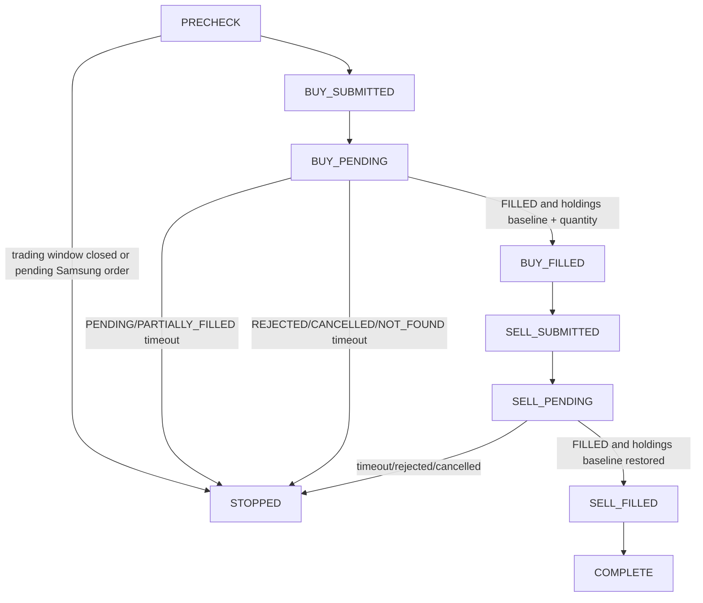
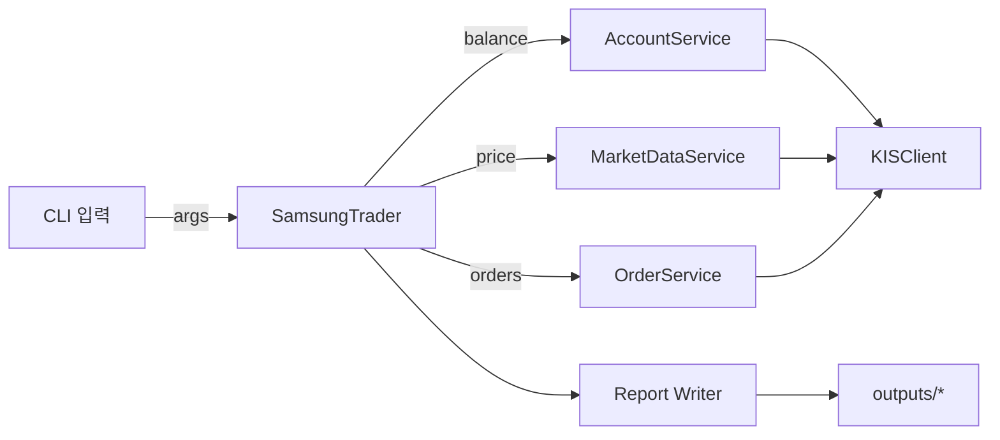
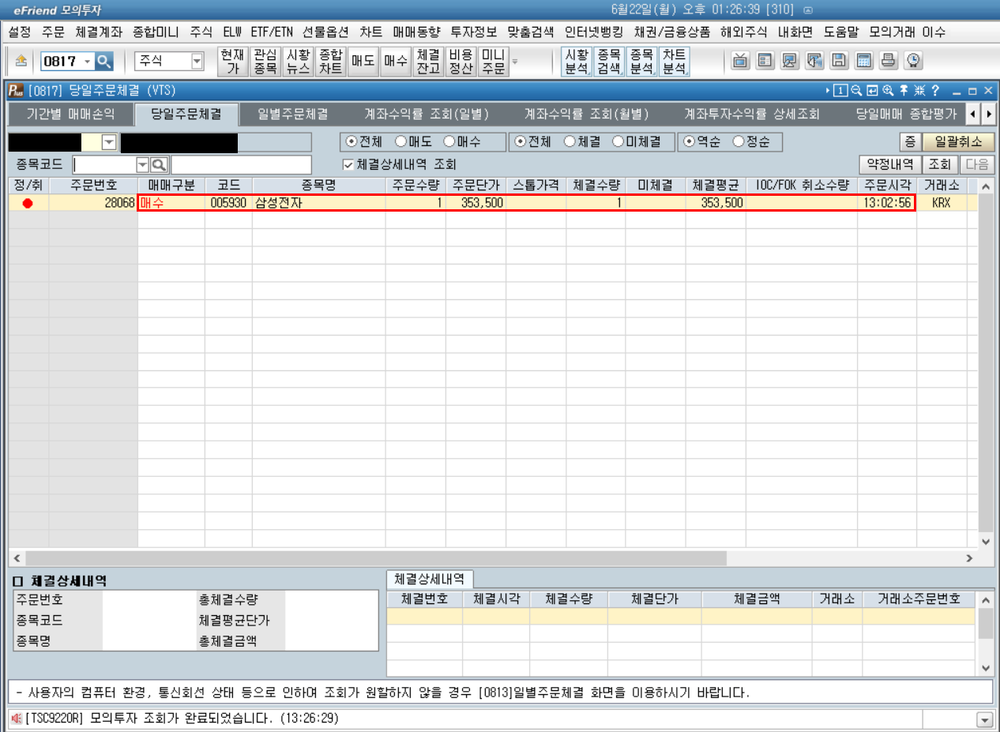
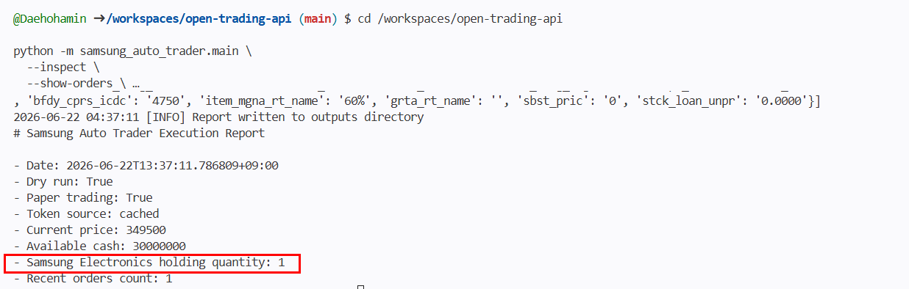
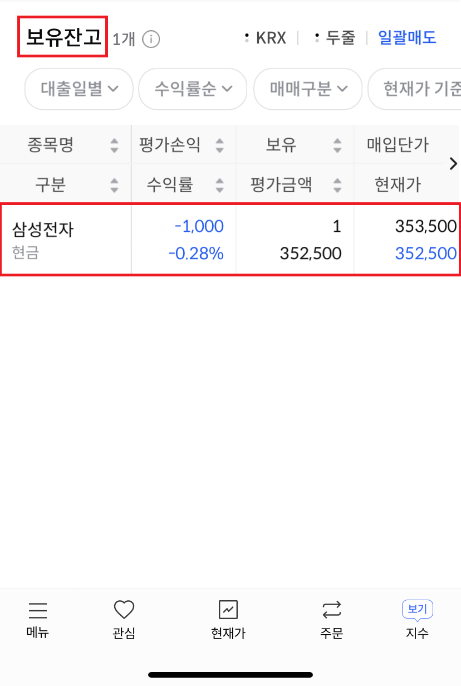

# Samsung Electronics Auto Trader

이 프로젝트는 한국투자증권(KIS) Open API REST만을 사용하여 삼성전자(005930) 모의투자 자동매매를 수행하는 Python 시스템입니다. REST 기반으로 안전한 모의투자 주문, 계좌 조회, 보고서 생성을 지원합니다.

## 주요 개선 사항
- `get_price()`는 `tr_id: FHKST01010100`을 전송합니다.
- `get_balance()`는 `tr_id: VTTC8434R`과 `CTX_AREA_FK100` / `CTX_AREA_NK100`을 포함합니다.
- 모의현금 주문 TR ID는 공식 예제 기준 `VTTC0012U`(buy), `VTTC0011U`(sell)입니다.
- 계좌 조회는 `output1`에서 보유 종목을, `output2`에서 예수금총액과 정산금액을 별도 파싱합니다.
- 매수 주문 수량은 `inquire-psbl-order`의 주문가능금액/수량 응답을 기준으로 하며, 최소 1주, 최대 `MAX_ORDER_QUANTITY`로 제한됩니다.
- 삼성전자 보유 수량이 부족하면 매도 주문을 제출하지 않습니다.
- 거래 시간은 `Asia/Seoul` 기준 `09:10–15:30`으로 계산합니다.
- 실거래는 항상 비활성화되며 `--no-paper-trading` 사용은 차단됩니다.
- `--no-dry-run`은 `--confirm-paper-order`와 함께 사용해야 합니다.
- `--inspect`, `--show-orders`, `--report`, `--quantity`, `--buy-only`, `--sell-only`, `--auto-cycle` 옵션을 지원합니다.
- `--auto-cycle`은 주문 접수번호(`ODNO`)를 저장하고 당일주문체결 조회로 `PENDING`, `PARTIALLY_FILLED`, `FILLED`, `REJECTED`, `CANCELLED`, `NOT_FOUND` 상태를 추적합니다.

## 실행 준비
### 필수 환경변수
- `GH_ACCOUNT`
- `GH_APPKEY`
- `GH_APPSECRET`

### 선택 환경변수
- `GH_PRODUCT_CODE` (기본값 `01`)

## 재현 및 운영 절차

아래 절차는 환경 확인, 코드 검증, 읽기 전용 조회, dry-run,
모의투자 주문, 주문 후 확인 순서로 구성됩니다.
모든 명령은 저장소 루트에서 실행합니다.

### 1. 저장소 및 환경 확인

```bash
cd /workspaces/open-trading-api
git pull --ff-only origin main
git status --short

python - <<'PY'
import os

for name in ["GH_ACCOUNT", "GH_APPKEY", "GH_APPSECRET", "GH_PRODUCT_CODE"]:
    print(name, "OK" if os.getenv(name) else "MISSING")
PY
```

`git status --short`에 출력이 없고 환경변수가 모두 `OK`이면 실행 준비가 완료된 상태입니다.
위 명령은 인증정보의 실제 값을 출력하지 않고 설정 여부만 확인합니다.

### 2. 코드 및 테스트 검증

```bash
python -m compileall samsung_auto_trader
python -m unittest discover -s tests -v
python -m samsung_auto_trader.main --help
```

- `compileall`은 Python 문법 오류를 검사합니다.
- 단위 테스트는 계좌 파싱, 주문 분기, 요청 제한, 예외 처리와 민감정보 제거를 검증합니다.
- 테스트에서는 실제 KIS 주문을 전송하지 않습니다.
- `--help`는 실행 가능한 CLI 옵션을 확인합니다.

### 3. 읽기 전용 현재 상태 조회

```bash
python -m samsung_auto_trader.main \
  --inspect \
  --show-orders
```

이 명령은 주문을 제출하지 않고 다음 항목만 조회합니다.

1. 삼성전자 현재가
2. 예수금총액 및 정산금액
3. 삼성전자 보유수량
4. 최근 모의투자 주문내역
5. 당일 token cache 재사용 여부

보고서 파일도 새로 생성하려면 다음 명령을 사용합니다.

```bash
python -m samsung_auto_trader.main \
  --inspect \
  --show-orders \
  --report

cat outputs/execution_report.md
```

`--report` 사용 시 `outputs/execution_report.md`,
`outputs/recent_orders.csv`, `outputs/account_summary.svg`가 갱신됩니다.

### 4. 주문 없는 dry-run

```bash
python -m samsung_auto_trader.main \
  --once \
  --dry-run \
  --quantity 1 \
  --buy-only \
  --offset 2000
```

dry-run은 실제 KIS 현재가, 계좌, 매수 주문가능수량을 조회한 뒤 매수 가격과 수량을 계산하지만
주문 POST 요청은 전송하지 않습니다.

정상 실행 시 다음과 유사한 로그가 표시됩니다.

```text
DRY_RUN enabled, skipping buy-only order.
```

### 5. KIS 모의투자 주문 제출

> [!WARNING]
> 아래 명령은 실거래가 아닌 KIS 모의투자 주문을 실제로 제출합니다.
> 평일 09:10–15:30 KST에 기존 보유수량과 미체결 주문을 확인한 뒤 한 번만 실행합니다.
> 이전 요청의 성공 여부가 불분명하면 같은 주문을 반복하지 않습니다.

```bash
python -m samsung_auto_trader.main \
  --once \
  --no-dry-run \
  --confirm-paper-order \
  --quantity 1 \
  --buy-only \
  --offset 2000
```

명령 옵션의 의미는 다음과 같습니다.

| 옵션 | 의미 |
|---|---|
| `--once` | 한 번의 거래 사이클만 실행한 뒤 종료 |
| `--no-dry-run` | 주문 전송을 허용 |
| `--confirm-paper-order` | 모의주문 전송 의사를 명시적으로 확인 |
| `--quantity 1` | 주문수량을 1주로 지정 |
| `--buy-only` | 매수 주문만 실행 |
| `--offset 2000` | 현재가에서 2,000원을 더하거나 뺀 raw 목표가 계산 |

주문 가격은 raw 목표가를 바로 사용하지 않고 KRX 호가단위에 맞춰 보정합니다.
매수 raw 가격은 유효 호가로 내림 처리하고, 매도 raw 가격은 유효 호가로 올림 처리합니다.

보유한 삼성전자 1주를 이용하여 매도 경로를 확인할 때는
`--buy-only`를 `--sell-only`로 변경합니다.
한 번의 시연에서는 두 옵션 중 하나만 사용합니다.

정상 접수 시 다음과 유사한 로그가 표시됩니다.

```text
Order accepted: rt_cd=0 order_number=...
모의투자 매수주문이 완료되었습니다.
```

### 6. 주문 후 체결 및 계좌 확인

```bash
python -m samsung_auto_trader.main \
  --inspect \
  --show-orders \
  --report

cat outputs/execution_report.md
```

다음 항목을 확인합니다.

- 최근 주문 건수
- 주문수량과 주문가격
- 체결 또는 미체결 상태
- 삼성전자 보유수량
- 주문 전후 계좌 상태

최종 체결 상태는 eFriend 모의투자 당일주문체결 화면과 한투 앱 보유잔고에서도 확인합니다.

### 7. Stateful auto-cycle 재시연

`--auto-cycle`은 매수 주문이 완전히 체결된 경우에만 같은 수량을 매도합니다.
주문 접수는 KIS가 주문을 받아 `ODNO`를 반환했다는 뜻이고, 체결은 당일주문체결 조회에서 `tot_ccld_qty`와 `rmn_qty`로 확인된 별도 상태입니다.
접수만 된 주문은 아직 보유수량 변경이 확정된 것이 아닙니다.

주문 없는 dry-run 명령:

```bash
python -m samsung_auto_trader.main \
  --once \
  --auto-cycle \
  --dry-run \
  --quantity 1 \
  --offset 2000 \
  --order-status-timeout 120 \
  --order-status-poll-interval 5
```

KIS 모의투자 buy-to-sell 주문 명령:

```bash
python -m samsung_auto_trader.main \
  --once \
  --auto-cycle \
  --no-dry-run \
  --confirm-paper-order \
  --quantity 1 \
  --offset 2000 \
  --order-status-timeout 120 \
  --order-status-poll-interval 5
```

> [!WARNING]
> 위 mock-order 명령은 실거래가 아닌 KIS 모의투자 주문을 실제로 제출합니다.
> `--no-paper-trading`은 차단되어 있으며 live trading은 지원하지 않습니다.
> 주문 상태가 `PENDING` 또는 `PARTIALLY_FILLED`인 동안에는 다음 주문을 제출하지 않습니다.

### 시연용 take-profit auto-cycle

인터뷰 시연용으로 `--buy-offset`과 `--take-profit`을 함께 사용하면 현재가 근처에 매수 limit 주문을 제출하고, 매수 전량 체결과 삼성전자 보유수량 증가가 확인된 뒤 평균 매수 체결가 기준 take-profit 매도 limit 주문을 제출합니다.

Dry-run:

```bash
python -m samsung_auto_trader.main \
  --auto-cycle \
  --once \
  --dry-run \
  --quantity 1 \
  --buy-offset 0 \
  --take-profit 500 \
  --order-status-timeout 120 \
  --order-status-poll-interval 5
```

Mock order:

```bash
python -m samsung_auto_trader.main \
  --auto-cycle \
  --once \
  --no-dry-run \
  --confirm-paper-order \
  --quantity 1 \
  --buy-offset 0 \
  --take-profit 500 \
  --order-status-timeout 600 \
  --order-status-poll-interval 5
```

- `--buy-offset 0`은 조회한 현재가 기준 매수 limit 가격을 의미합니다.
- `--take-profit 500`은 평균 매수 체결가 + 500 KRW로 매도 limit 가격을 계산합니다.
- 여전히 limit 주문이므로 체결은 보장되지 않습니다.
- 주문이 pending 상태인 동안에는 중복 주문을 제출하지 않습니다.

Auto-cycle 상태 흐름:



Order status 필드:

| 필드 | 의미 |
|---|---|
| `order_number` | KIS 주문 접수번호 `ODNO` |
| `side` | 매수/매도 구분 |
| `symbol` | 종목코드, 삼성전자는 `005930` |
| `ordered_quantity` | 원주문 수량 `ord_qty` |
| `filled_quantity` | 총 체결 수량 `tot_ccld_qty` |
| `remaining_quantity` | 미체결 잔량 `rmn_qty` |
| `order_price` | 주문 단가 `ord_unpr` |
| `average_fill_price` | 평균 체결가 `avg_prvs` |
| `rejected_quantity` | 거부 수량 `rjct_qty` |
| `cancelled` | 취소 여부 `cncl_yn` |
| `status` | `PENDING`, `PARTIALLY_FILLED`, `FILLED`, `REJECTED`, `CANCELLED`, `NOT_FOUND` 중 하나 |

코드 위치:

| 파일 | 역할 |
|---|---|
| `samsung_auto_trader/trader.py` | state machine |
| `samsung_auto_trader/api_client.py` | REST and order status |
| `samsung_auto_trader/orders.py` | buy/sell submission |
| `samsung_auto_trader/account.py` | holdings |

### 8. 내부 처리 흐름

1. Codespaces Secrets에서 계좌번호와 API 인증정보를 읽습니다.
2. 당일 발급된 OAuth token이 있으면 cache에서 재사용합니다.
3. 삼성전자 `005930` 현재가를 REST API로 조회합니다.
4. 모의계좌 보유수량과 예수금/정산금액을 조회합니다.
5. raw 목표가는 매수 `현재가 - offset`, 매도 `현재가 + offset`으로 계산합니다.
6. 매수 가격은 유효한 KRX 호가단위로 내림 처리하고, 매도 가격은 유효한 KRX 호가단위로 올림 처리합니다.
7. 매수 주문을 평가할 때만 보정된 매수 가격으로 `inquire-psbl-order`를 호출해 주문가능금액과 주문가능수량을 조회합니다.
8. dry-run이 아니고 명시 확인 옵션이 있을 때만 모의주문을 전송합니다.
9. 일반 모드에서는 주문 후 계좌와 주문내역을 다시 조회하여 체결 여부를 확인합니다.
10. `--auto-cycle`에서는 주문 접수번호로 상태를 polling하고, 매수 전량 체결 및 보유수량 증가가 확인된 경우에만 매도를 제출합니다.
11. `--once` 모드에서는 한 사이클 후 종료합니다.

KIS 모의투자의 낮은 호출 제한을 고려하여 REST 요청 사이에는 기본 1.2초 간격을 적용하고,
주문 POST 요청은 중복 주문 위험 때문에 자동 재시도하지 않습니다.

## 옵션 설명
- `--once`: 한 사이클만 실행하고 종료
- `--dry-run`: 주문을 전송하지 않음
- `--no-dry-run`: 실제 주문 전송 허용 전 단계
- `--confirm-paper-order`: `--no-dry-run`과 함께 사용해야 함
- `--paper-trading`: 모의투자 TR ID 사용
- `--no-paper-trading`: 금지됨(실거래 비활성화 유지)
- `--offset`: 매수/매도 가격 오프셋
- `--buy-offset`: auto-cycle 매수 가격 전용 오프셋. 생략 시 기존 `--offset` 동작 유지
- `--take-profit`: auto-cycle 매도 가격을 평균 매수 체결가 + 지정 KRW로 계산
- `--cycle-count`: auto-cycle 완료 횟수 상한. `--once` 사용 시 1회만 실행
- `--quantity`: 주문 수량 (기본값 1)
- `--buy-only`: 매수만 실행
- `--sell-only`: 매도만 실행
- `--show-orders`: 최근 주문 내역 표시
- `--report`: 민감 정보를 제거한 보고서 생성
- `--inspect`: 읽기 전용 상태 점검
- `--auto-cycle`: 매수 체결 확인 후 매도까지 수행하는 stateful 모의투자 사이클
- `--order-status-timeout`: 주문 상태 polling 제한 시간(초)
- `--order-status-poll-interval`: 주문 상태 polling 간격(초)

## 안전 설계
- 기본 모드: `dry_run` 및 `paper_trading` 활성화
- `--no-dry-run`은 `--confirm-paper-order`와 함께만 동작
- `dnca_tot_amt`는 예수금총액, `nxdy_excc_amt`는 익일정산금액, `prvs_rcdl_excc_amt`는 가수도정산금액으로 표시합니다.
- 예수금총액과 정산금액은 실제 주문가능금액이 아니므로 매수 수량 계산의 대체값으로 사용하지 않습니다.
- 매수 수량은 KRX 호가단위로 보정된 주문가격을 사용해 `inquire-psbl-order`에서 받은 `nrcvb_buy_qty`로 제한합니다.
- 보유 내역은 `output1`에서 추출
- 주문 수량은 최소 1주, 최대 `MAX_ORDER_QUANTITY`
- 거래창은 `Asia/Seoul` 기준 `09:10–15:30`
- websocket 미사용, REST polling만 사용
- 주문 접수(`Order accepted`, `ODNO` 반환)는 체결이 아닙니다. 체결 여부는 당일주문체결 조회의 수량 필드로 별도 확인합니다.
- `--auto-cycle`은 주문 POST를 자동 재시도하지 않고, timeout 시 다음 주문을 제출하지 않습니다.

## outputs
- `outputs/execution_report.md`: 실행 보고서
- `outputs/recent_orders.csv`: 최근 주문 기록
- `outputs/account_summary.svg`: 계좌 요약 시각화

## 검증 명령
- `python -m compileall samsung_auto_trader`
- `python -m unittest discover -s tests -v`
- `python -m samsung_auto_trader.main --help`
- `python -m samsung_auto_trader.main --inspect --show-orders --report`
- `python -m samsung_auto_trader.main --once --dry-run --quantity 1`
- `python -m samsung_auto_trader.main --once --auto-cycle --dry-run --quantity 1 --offset 2000 --order-status-timeout 120 --order-status-poll-interval 5`

## 아키텍처 다이어그램


## 테스트 요약
- `tests/test_account_and_trader.py`: 계좌 파싱, 주문 모드, 예외 로깅, 보고서/CSV 생성 검증
- 모든 테스트는 `python -m unittest discover -s tests -v`로 실행 가능

## Known limitations
- 현재 구현은 KIS mock REST API 전용이며 websocket 또는 실거래를 지원하지 않습니다.
- 외부 API가 응답하지 않으면 최신 주문 내역은 `최근 주문내역 조회 불가`로 처리됩니다.
- 거래 창 외부에서는 실제 주문 로직이 실행되지 않습니다.

## 실제 모의투자 주문 증빙

아래 결과는 2026년 6월 22일 KIS 모의투자 환경에서 실행한 mock trading 증빙입니다.

- 종목: 삼성전자 005930
- 주문 유형: 지정가 매수
- 주문 수량: 1주
- 주문 가격: 353,500 KRW
- 주문 시각: 13:02:56 KST
- 체결 수량: 1주
- 미체결 수량: 0주
- 최종 상태: 전량 체결
- 체결 후 계좌 점검: 보유 수량 1주 확인
- 최근 주문 건수: 1건

실행 명령:

```bash
python -m samsung_auto_trader.main \
  --once \
  --no-dry-run \
  --confirm-paper-order \
  --quantity 1 \
  --buy-only \
  --offset 2000
```

### eFriend 모의투자 체결 내역



### Codespaces 체결 후 계좌 확인



### 한투 앱 체결 후 보유 잔고



## 실행 증빙

아래 이미지는 모의투자 API 연결과 안전 실행을 확인한 결과입니다. 계좌번호, 인증값, access token 등 민감정보는 가렸습니다.

### Postman OAuth 토큰 발급 성공

KIS Developers 모의투자 인증정보로 `V_토큰발급` 요청을 실행해 `200 OK`와 Bearer token 발급을 확인했습니다.


### Postman 모의투자 잔고조회 성공

발급된 token으로 국내주식 잔고조회 요청을 실행해 `rt_cd: "0"`과 모의투자 계좌 응답을 확인했습니다.


### GitHub Codespaces dry-run 성공

Codespaces 환경변수를 사용하여 dry-run 모드로 한 사이클 실행을 검증했습니다. 실행 결과 당일 token cache를 재사용했고, `dry_run=True`, `paper_trading=True` 상태에서 거래시간 외 주문 차단 로직이 정상 작동했습니다.


